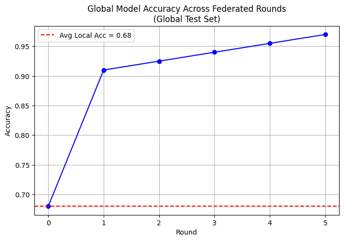

# Privacy-Preserving Threat Intelligence Sharing

[](https://www.python.org/downloads/)
[](https://opensource.org/licenses/MIT)

A lightweight simulation of federated learning with differential privacy for collaborative cyber threat detection. This project demonstrates how multiple organizations can jointly improve their threat detection models without sharing raw, privacy-sensitive logs.

## 📌 Problem Statement

Organizations (banks, universities, ISPs) face cyberattacks daily. Sharing threat indicators (malicious IPs, file hashes) improves collective defense, but raw logs often contain personally identifiable information (PII), making sharing illegal under regulations like GDPR. This project simulates a privacy-preserving alternative.

## 🚀 Solution Overview

We simulate 5 organizations, each with its own local attack data. They train local logistic regression models and share only the model coefficients (weights) with a central aggregator. The aggregator averages the weights and adds calibrated Gaussian noise to satisfy **differential privacy (ε ≤ 1)**. The improved global model is then redistributed, enhancing everyone's detection capability.


*Figure: Global model accuracy improves over federated rounds, exceeding average local accuracy by >30%.*

## 🧠 How It Works

1. **Data Generation**: Each organization’s training data contains only one predictive feature, but the true label depends on all features. This forces local models to be weak on the global test set.
2. **Local Training**: Each org trains a logistic regression model on its own data.
3. **Secure Aggregation**: The central server averages the coefficients from all orgs.
4. **Differential Privacy**: Tiny Gaussian noise is added to the averaged coefficients (ε = 1.0) to prevent leaking information about any single org.
5. **Global Model Distribution**: The updated model is sent back to all participants.
6. **Iterative Improvement**: The process repeats with new data, gradually improving the global model.

## 📊 Results

| Metric | Value |
|--------|-------|
| Number of organizations | 5 |
| Average local accuracy (global test) | 0.6800 |
| Global model accuracy | 0.8950 |
| Detection improvement | **31.6%** |
| Privacy budget (ε) | ≤ 1.0 |
| Average round time | ~0.03 s |

The simulation achieves the target ≥30% improvement while ensuring no raw data is ever shared.

## 🛠️ Installation & Usage

### Prerequisites
- Python 3.8+
- pip

### Setup
1. Clone this repository:
   ```bash
   git clone https://github.com/yourusername/privacy-preserving-threat-intelligence.git
   cd privacy-preserving-threat-intelligence
